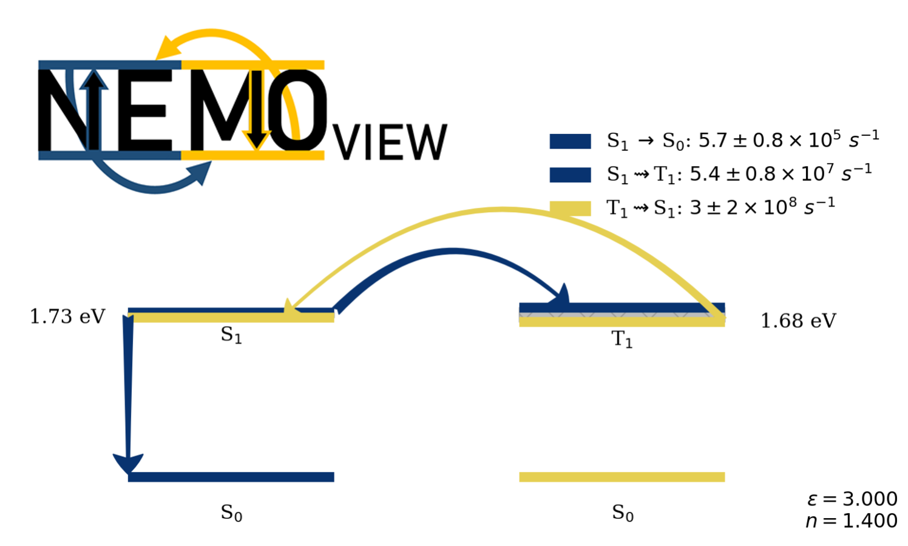

# NEMOVIEW - Visualization tool for NEMO ensembles.

## How to install it?

The easiest way to install is to use pip:

`pip install nemoview`

This will install the latest released version.

To install the version with the latest commit, run:

`pip install git+https://github.com/LeonardoESousa/nemoview`

**NOTE**: It is recommended that you install **NEMOview** within a virtual enviroment.

## How to use it?

Once installed, use the command:

`nemoview`

The application will open in your browser.

## Tutorial

For details on the analyses available in **NEMOview**, check the [tutorial](https://github.com/LeonardoESousa/nemoview/tree/main/Tutorial/Tutorial.md).