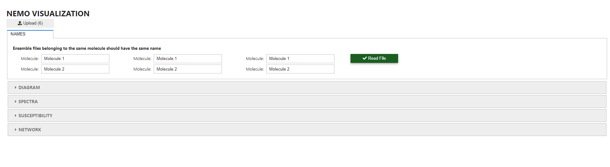
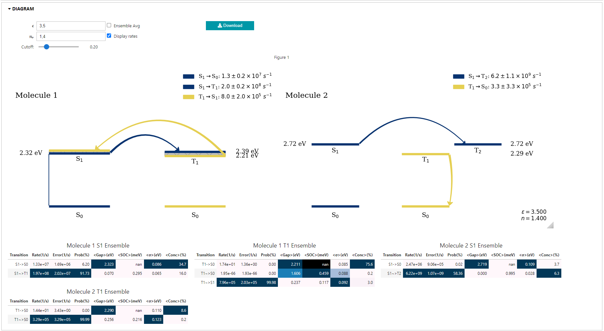
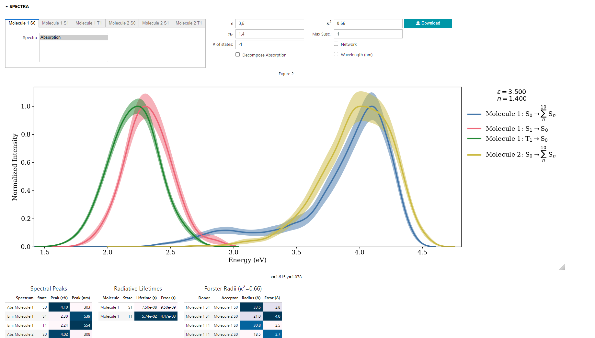
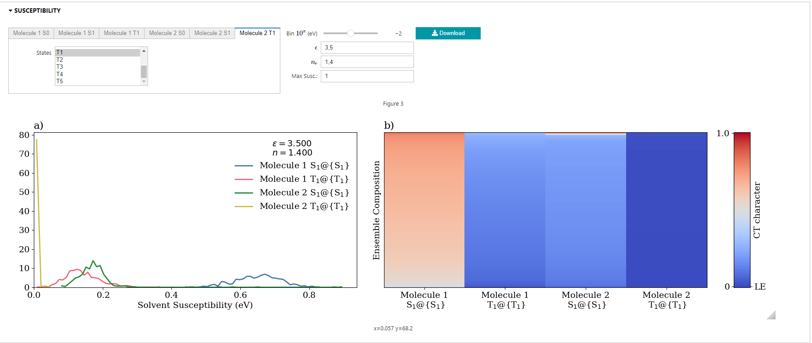
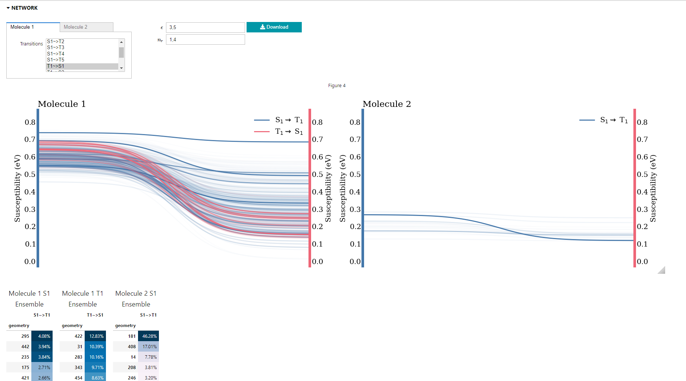

# Introduction

In the following, we will learn how to use Nemoview package to visualize results of NEMO ensemble calculations.

# How to Install It?

The simplest way is to run:

`pip install nemoview`

To intall the latest commit, run:

`pip install git+https://github.com/LeonardoESousa/nemoview`

It is recommended that you install nemoview within a virtual enviroment. 

# How to Run It?

From a terminal, use the command:

`nemoview`

The application will open in your browser. 

# Uploading Ensemble Files

Click on the **Upload** button. Select the ensemble files you want to analyze. You may select several ensemble files for different states and/or different molecules to be analyzed simultaneously. Examples of ensemble files can be found [here](https://github.com/LeonardoESousa/nemoview/tree/main/Tutorial).

Once the ensemble files are loaded, a widget appears where one is able to change the ensemble file names. Ensembles obtained from a same molecule in different states ($S_0$, $S_1$, $T_1$ etc) should have the same name. This will help nemoview bundle together the information for each molecule. For example, if you uploaded six ensembles -- $S_0$, $S_1$ and $T_1$ ensembles for molecule A and $S_0$, $S_1$ and $T_1$ ensembles for molecule B --, use the text boxes and write A in the fields corresponding to ensembles coming from molecule A and B in the fields corresponding to ensembles coming from molecule B. Any name will do, as long as it is different for each molecule. Once this is done, go ahead and click on **Read file**.

# Analysis

After the files are read, a four tabs will appear, each correponding to a kind of analysis:  **Diagram**, **Spectra**, **Susceptibility** and **Network**.

## Diagram
<figure>
  
  <figcaption>Example of levels diagram generated simultaneously for two molecules.</figcaption>
</figure>

The **Diagram** tab shows the energy levels diagram automatically built from the ensemble data. Curved arrows denote non-radiative transfers (ISC) whereas straight arrows denote radiative transfers (fluorescence and phosphorescence). Arrow thickness is proportional to the quantum yield of each transition as calculated by NEMO. Singlet states and transition from singlet states are shown in blue. Yellow is used for triplet states and transitions that start from them. If ensembles for more than one molecule are present, results for each molecule are presented sida by side for direct comparison. 

Below the diagram you will find a set of tables, one for each excited state ensemble provided. These tables display the different rates that NEMO managed to calculate with the following information:

 - Transition: The kinds of transitions NEMO was able to compute. These are labeled by the initial state, an arrow indicating the kind of transition and final state. Radiative transitions are denoted by "->" whereas nonradiative transitions are denoted by "~>". 

 - Rate: The rate associated for each transition in $s^{-1}$.

 - Error: The uncertainty due to sampling error associated to each rate estimate in $s^{-1}$.  

 - Prob: The probability for each transition in %. This probability is calculated by computing the ratio between the rate and the sum of all rates computed from that same initial state.

 - &lt;Gap&gt;: The average energy gap for each transition in eV.

 - &lt;SOC&gt;: The average spin-orbit coupling associated with each transition in meV.

 - $<\sigma>$: The average standard deviation in eV of the gaussian functions in the nuclear ensemble-derived expressions for rates. 

 - &lt;Conc&gt;: The average fraction in % of conformations in the ensemble who are actively contributing to the total calculated rate.

### Options

Some options are available to change the presentation of results in this tab.

 - $\epsilon$: Solvent dielectric constant. Changing this number introduces solvent corrections to the calculated rates.

 - $n_r$: Solvent refractive index. Changing this number introduces solvent corrections to the calculated rates.

 - Cutoff: Select the minimum probability (from 0 to 1) that a transition must have to be depicted in the diagram. This can be used to focus the diagram on the most relevant transitions.

 - Ensemble Avg: Checking this box changes the way with which averages are calculates. The default (unchecked box) is to perform weighted averages using the contributions of each individual conformation in the ensemble as weights. This is the most sensible averaging scheme. Checking the box changes the method to a simple ensemble average in which all conformations are treated equally. 

 - Display rate: Checking this box makes makes the numerical values of each rate visible in the diagram.

 - Download: Here you can obtain a high resolution transparent png file of the diagram. The figure will be saved in the same folder from which nemoview was initialized. 

## Spectra
<figure>
  
  <figcaption>Example of absorption and emission spectra for two molecules. Tables below show spectral peaks, radiative lifetimes and Förster radii.</figcaption>
</figure> 

Here, molecular spectra are presented. The kind of spectrum depends on the ensemble state. For S0 ensembles, only absorption spcetrum is available. For excited state ensembles, emission (fluorescence for singlets and phosphorescence for triplets) and absorption spectra are available. You may select which spectra to display from the window in the left. To show more than on spectrum at the same time, click on the corresponding spectrum while holding the "ctrl" key. All spectra are normalized before plotting.

Below the spectrum plots, three tables are shown:

1. Spectral Peaks: Displays the position of the spectral peaks in eV and nm of all spectra being plotted.

2. Radiative Lifetimes: Displays the radiative lifetime in s of the selected excited states along with the corresponding uncertainty.

3. Förster Radii: Displays the Förster radii in Å calculated from the simulated spectra for all possible combinations of donor and acceptor. Includes Förster radii for triplet-to-singlet transitions. Uncertainties are also displayed. 

### Options

Some options are available to change the presentation of results in this tab.

 - $\epsilon$: Solvent dielectric constant. Changing this number introduces solvent corrections to the spectra.

 - $n_r$: Solvent refractive index. Changing this number introduces solvent corrections to the spectra.

 - \# of states: Number of states to be included in the absorption spectra. Usually absorption spectra include transitions to several final states. Here you may choose how many to account for in the plotting of the spectrum. A value of -1 signals that all available states should be used. 

 - Decompose Absorption: Checking this box will show, along with the total absorption spectrum, the individual spectra corresponding to each transition that make the total absorption spectrum. If checked, the Spectral Peaks tabvle will also display the peak position of each of these individual spectra.

 - $\kappa^2$: The orientation factor used to compute Förster radii. A default value of 0.66 is used corresponding to the value for isotropic distribution of molecules. This factor may vary from 0 to 4.

 - Network: Displays a mapping between the solvent susceptibility of each conformation that makes an ensemble and their emission or absorption energy. The opaqueness of the lines is proportional to the contribution of that conformation to the total spectrum. If checked, besides the mapping, a table with the 5 conformations that contribute the most to the spectra is shown. Higher susceptibilities are associated with warmer colors. More details on solvent susceptibility can be found on the next section. 

 - Max. Susc.: Maximum susceptibility in eV considered for coloring the network map. This is used to adjust the colormap of susceptibilities.

 - Wavelength (nm): Changes the x axis of the spectrum plots from eV to nm.

 - Download: Here you can obtain a high resolution transparent png file of the spectra. The figure will be saved in the same folder from which nemoview was initialized. 

### Susceptibility
<figure>
  
  <figcaption>Susceptibility plots show how sensitive different excited states are with respect to changes in solvent polarity. It also serves as a proxy for the degree of charge transfer character of a state.</figcaption>
</figure> 

Solvent susceptibility is defined as the ratio between the nonequilibrium state-specific solvent correction $\lambda^{neq}$ and $\alpha_{opt} = (n_r^2-1)/(n_r^2+1)$. It corresponds to the maximum solvent correction that state can suffer, meaning the energy correction due to a solvent in the limit of $n_r \to \infty$. The higher the susceptibility of a state, the higher the sensitivity of that excited state with respect to changes in solvent polarity. As such it correlates with the degree of charge-transfer character of the state. 

In this tab, two plots are shown. The first one shows the distribution of susceptibilites for each selected state of each ensemble. The second one displays the same data in the form of a heatmap, indicating the composition of each ensemble in terms of solvent susceptibility. 

The states to be displayed can be selected from the window in the left. To analyse more than one state at the same time, click on the corresponding state while holding the "ctrl" key.

### Options

Some options are available to change the presentation of results in this tab.

 - $\epsilon$: Solvent dielectric constant. Changing this number introduces solvent effects. These will only change the plots if Nemoview detects a change in the ordering of states due to strong red shift in an excited state making its energy drob below that of the excited state that was below it. 

 - $n_r$: Solvent refractive index. Changing this number introduces solvent effects. These will only change the plots if Nemoview detects a change in the ordering of states due to strong red shift in an excited state making its energy drob below that of the excited state that was below it. 

 - Bin 10^x (eV): Selects the bin size to be used on the plot with the distribution of sucsceptibilites. Depending on the characteristics of the ensemble, different values may produce better visualization. 

 - Max. Susc.: Maximum susceptibility in eV considered for coloring the ensemble coposition plot. This is used to adjust the colormap of susceptibilities.

 - Download: Here you can obtain a high resolution transparent png file of the susceptibility plots. The figure will be saved in the same folder from which nemoview was initialized. 

### Network
<figure>
  
  <figcaption>Network plots show the mapping between the susceptibility of initial and final states in ISC processes. Mappings from low to high susceptibility (and vice versa) indicate transitions between states of different electronic character.</figcaption>
</figure>

The network tab shows a mapping between the solvent susceptibilities of each conformation in the ensemble from the initial state to the final state for ISC transfers. For example, take the S1~>T1 transfer. Each conformation in the ensemble contributes with the total rate with a certain amount and each conformation has a certain $S_1$ and $T_1$ energies. The network map connects the solvent susceptibility of the $S_1$ state of each conformation with the corresponding solvent susceptibility of the $T_1$ state. Line opaqueness is proportional to the contribtution of each conformation to the total rate.  In this sense, curves that go from high to low susceptibility indicate that the ISC transfer takes place between a charge-transfer $S_1$ state and a localized $T_1$ state. As such, the network map allows to investigate the validity of El Sayed's rule for a given molecule. Singlet to triplet ISC transfers are shown from left to right, whereas triplet to singlet transfers are shown right to left. More than one transfer can be mapped at the same time from the window in the left. To analyse more than one transfer at the same time, click on the corresponding state while holding the "ctrl" key. 

Below the plot, one table is displayed for each transfer selected. The tables show the top 10 conformations as measured by the size of their contributions to the total rate. This can be used to determine which conformations of the ensemble are more relevant for the ISC transfers. 

### Options

Some options are available to change the presentation of results in this tab.

 - $\epsilon$: Solvent dielectric constant. Changing this number introduces solvent effects.

 - $n_r$: Solvent refractive index. Changing this number introduces solvent effects.

 - Download: Here you can obtain a high resolution transparent png file of the susceptibility plots. The figure will be saved in the same folder from which nemoview was initialized. 